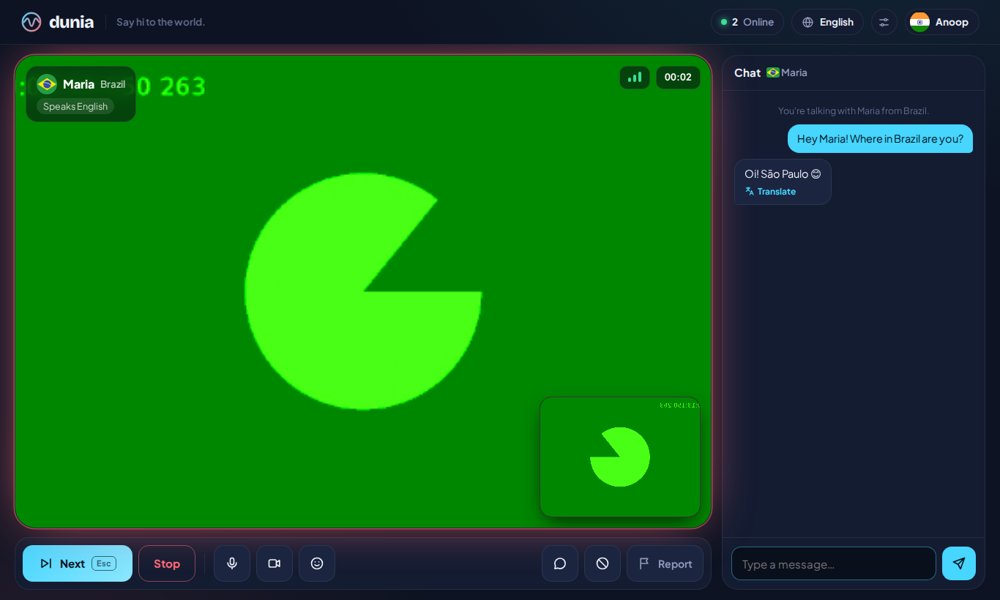
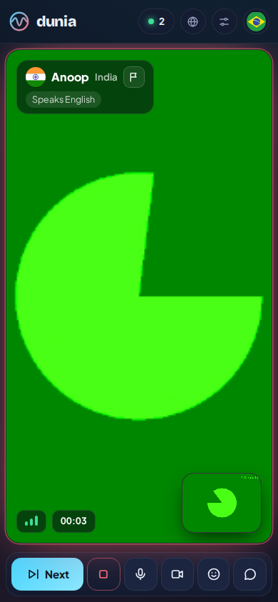
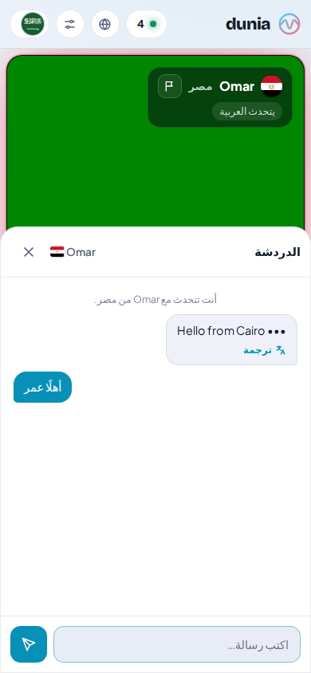
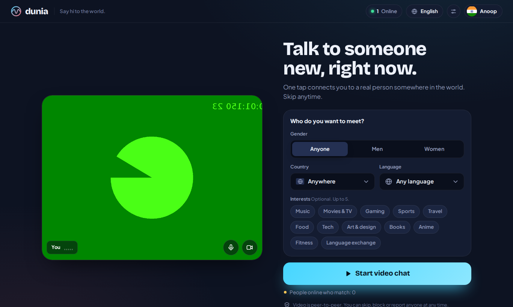
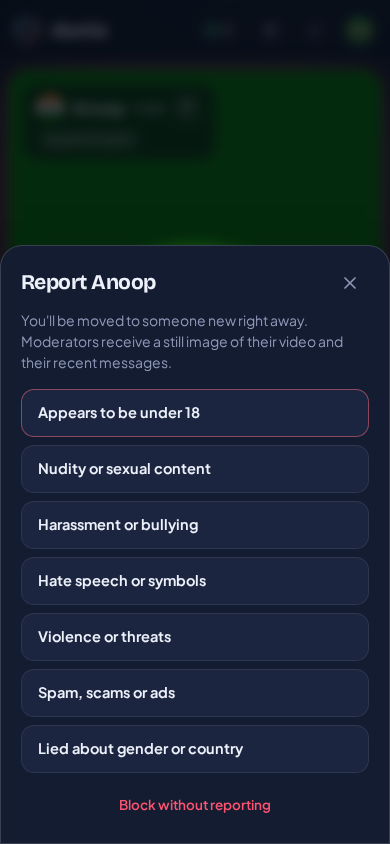
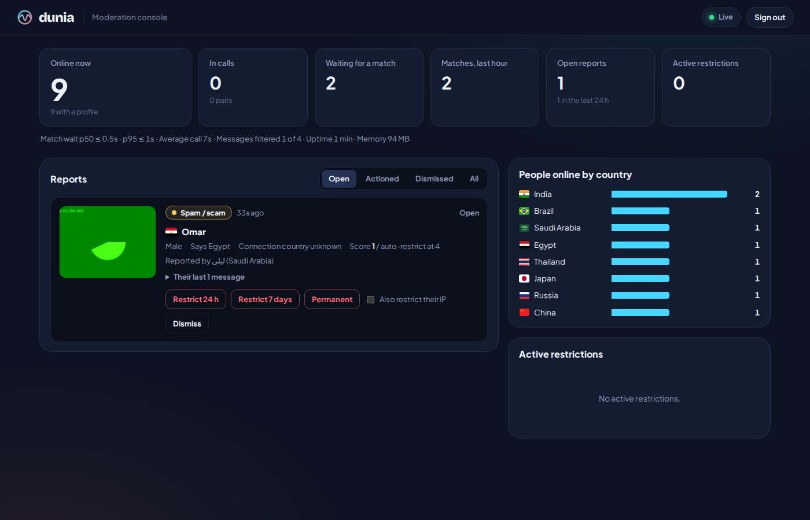

# Dunia — say hi to the world

**Dunia** is a random 1-to-1 video chat platform for the whole world: one tap connects you to a real
person in another country, in your language, with the filters you choose. It's a production-ready
rebuild of the earlier Wavelength prototype.

*Dunia* means "world" in Swahili, Indonesian and Malay, and it's nearly the same word in Hindi and Urdu
(*duniya*), Arabic (*dunya*), Turkish (*dünya*) and Persian (*donyā*). More than a billion and a half
people recognise it, which is why it was chosen as a global brand.

| Desktop call | Phone call | Arabic (right-to-left) |
|---|---|---|
|  |  |  |
| **Lobby with filters** | **Report sheet** | **Moderation console** |
|  |  |  |

*(Screenshots from the automated browser test; the green shapes are Chromium's fake camera.)*

---

## What's inside

| Area | Highlights |
|---|---|
| **Onboarding** | 4 steps: name (with "Surprise me") → male/female → country (auto-detected, searchable flag picker) + languages you speak + 18+ consent → camera check with live mic meter |
| **Matching** | Gender, country and language filters, **always mutual**; interest and language-aware scoring; fairness aging; rematch cooldown; blocks. Handles ~28,500 searches/s on one core |
| **Worldwide** | **20 interface languages** (auto-detected), right-to-left Arabic & Urdu, 201 countries and territories with SVG flags, country & language names localised automatically, on-device message translation (Chrome) |
| **Call** | Peer-to-peer WebRTC video, "Connecting…" until the first frame, connection-quality meter, timer, emoji reactions, mute/camera state shown to the partner, camera flip & device picker, draggable self-view, swipe-left to skip on phones |
| **Chat** | Typing indicator, translate button, links/phones/e-mails/@handles masked automatically, blocked-word list |
| **Safety** | Report (7 reasons) with video snapshot + recent messages as evidence, block, weighted auto-restriction by distinct reporters, CGNAT-aware IP handling, optional "blur new video until I tap" |
| **Operations** | Moderation console (`/admin`), Prometheus `/metrics`, `/healthz`, Docker + Caddy (auto-HTTPS) + coturn (TURN) stack, graceful shutdown, strict CSP |
| **Quality** | 63 unit/integration tests, browser end-to-end test with real WebRTC, matchmaker benchmark, socket load test |

## Quick start (local)

```bash
npm install
npm start
# open http://localhost:3000 in two browser windows (or one normal + one private window)
```

Camera and microphone only work on `https://` or `localhost`. For phones on your Wi-Fi, use a tunnel
(for example `npx localtunnel --port 3000`) or deploy (see below).

## Go live

The full walkthrough is in [docs/DEPLOYMENT.md](docs/DEPLOYMENT.md). The short version, on any Linux server with Docker:

```bash
cp .env.example .env        # set DOMAIN, PUBLIC_IP, ADMIN_TOKEN, TURN_SECRET (openssl rand -hex 32)
docker compose up -d --build
```

That starts Dunia, Caddy (free automatic HTTPS) and coturn (the TURN relay that makes the ~15% of
calls behind strict networks connect). Open `https://your-domain/admin` and paste your `ADMIN_TOKEN` to moderate.

## Documentation

| Document | For | What it covers |
|---|---|---|
| [docs/USER-GUIDE.md](docs/USER-GUIDE.md) | Everyone | How to use Dunia: first visit, filters, calls, shortcuts, safety tools, troubleshooting |
| [docs/MATCHING.md](docs/MATCHING.md) | Engineers | The matching algorithm step by step, with worked examples and benchmarks |
| [docs/ARCHITECTURE.md](docs/ARCHITECTURE.md) | CTO / engineers | System design, protocol, scaling plan, capacity and cost model, security |
| [docs/SAFETY.md](docs/SAFETY.md) | Trust & Safety | Moderation design, reports and restrictions, the moderator workflow, legal checklist |
| [docs/DEPLOYMENT.md](docs/DEPLOYMENT.md) | Operators | Local, Docker/VPS, Cloudflare, TURN, monitoring, backups, upgrades |
| [docs/I18N.md](docs/I18N.md) | Translators | Adding or fixing a language, right-to-left rules |

## Project layout

```
server/            Node.js signaling + matchmaking server (ES modules, no framework beyond Express + Socket.IO)
  index.js         HTTP + socket wiring, protocol handlers
  matchmaker.js    pure matching engine (indexes, scoring, sweep)
  relations.js     blocks and rematch cooldown
  safety.js        reports, weighted auto-restriction, bans, persistence
  moderation.js    chat/username filtering, contact-sharing protection
  geo.js           client IP + country detection (CDN headers, optional GeoIP)
  turn.js          ICE servers with short-lived TURN credentials
  admin.js         moderator API       metrics.js  Prometheus metrics
shared/data.js     countries, languages, locales, interests (used by server AND browser)
public/            the web app (no build step): index.html, css/, js/, locales/*.json (20 languages)
  admin.html       moderation console        legal.html  guidelines, privacy, terms (templates)
test/              node:test unit + integration tests, e2e/ browser test
bench/             matchmaker benchmark, socket load test
deploy/            Caddyfile, turnserver.conf         Dockerfile, docker-compose.yml, .env.example
```

## Scripts

| Command | What it does |
|---|---|
| `npm start` | Run the server (reads `.env` if present) |
| `npm run dev` | Run with auto-restart on file changes |
| `npm test` | 63 unit + integration tests (≈2 s) |
| `npm run test:e2e` | Two real browsers, real video call, report → moderation console (`npx playwright install chromium` first) |
| `npm run bench` | Matchmaker benchmark on a realistic population |
| `npm run loadtest -- 3000 60` | 3,000 simulated people for 60 s against a real server process |

## Measured performance

Measured on a 2-vCPU cloud sandbox with Node 22 (your server will likely be faster):

| Test | Result |
|---|---|
| Matchmaker, 200k arrivals, skewed population (70% men, 45% of them filtering for women) | **28,490 searches/s on one core**, median 6 µs, p99 0.19 ms |
| Worst case: 100,000 men-filtering-for-women already queued | Open-filter newcomers still pair instantly (p99 33 µs) |
| 5,000 simulated people skipping every 1.5–4.5 s (≈10× real churn) | 0 connection errors, **1,100 matches/s**, 95% matched within 11 ms, server at **33% of one core, 293 MB** |

What this means in practice is in [docs/ARCHITECTURE.md](docs/ARCHITECTURE.md#capacity): one modest server comfortably handles tens of
thousands of people online at once. Video never passes through the server (it's peer-to-peer), which is what keeps this cheap.

## Before you launch publicly

Random video chat with strangers is one of the highest-risk consumer products there is (Omegle shut down in 2023 after
years of child-safety lawsuits). The code gives you the tools; launching responsibly also needs people and policy.
[docs/SAFETY.md](docs/SAFETY.md#launch-checklist) has the checklist: moderators on shift, CSAM hash-matching and reporting,
age assurance, a grievance officer where required (for example under India's IT Rules), and lawyer-reviewed terms.

## License

MIT for the code. Flag images: [flag-icons](https://github.com/lipis/flag-icons) (MIT). Fonts: Bricolage Grotesque and
Plus Jakarta Sans (SIL Open Font License), self-hosted.
